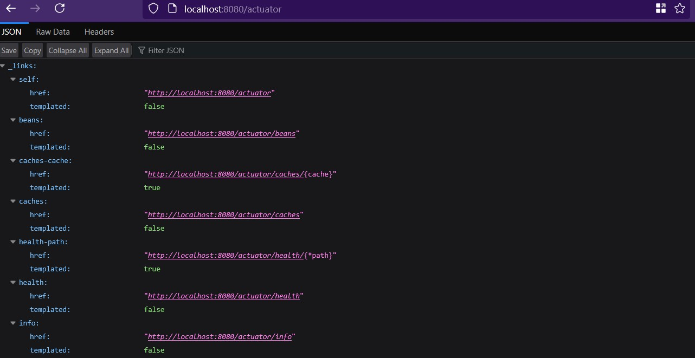
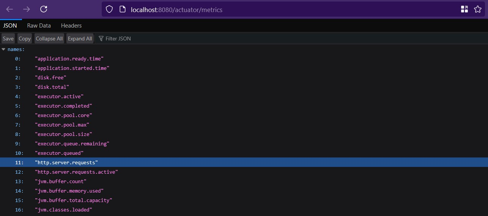

# Notes
In `@SpringBootApplication` class, a `RestClient` bean is created.
It uses a free online REST API: `https://jsonplaceholder.typicode.com`

## Endpoints
`/api/posts` [GET]\
Get all post data.

`/posts/{id}` [GET]\
Get post item under given `id`.

## Instructions
Run Spring Boot application.\
Run Docker Desktop.

To call an endpoint, run this command in terminal:\
`curl http://localhost:8080/api/posts` \
`curl http://localhost:8080/api/posts/1`

Or go to the endpoint in a browser:\
API #1


API #2


## Actuator
`curl http://localhost:8080/actuator`


`curl http://localhost:8080/actuator/metrics`


Show all HTTP requests collected
`curl http://localhost:8080/actuator/metrics/http.server.requests`


### Using `@Observed`
```
    @Bean
	@Observed(name = "posts.load-all-posts", contextualName = "post.find-all")
	CommandLineRunner commandLineRunner(JsonPlaceholderService jsonPlaceholderService) {
		return args -> {
			List<Post> posts = jsonPlaceholderService.findAll();
			log.info("All Posts: {}", posts.size());
		};
	}
```
`curl http://localhost:9411/zipkin`


### With Spring Security
Need to log in for non-actuator endpoints\
e.g. `/api/posts`


